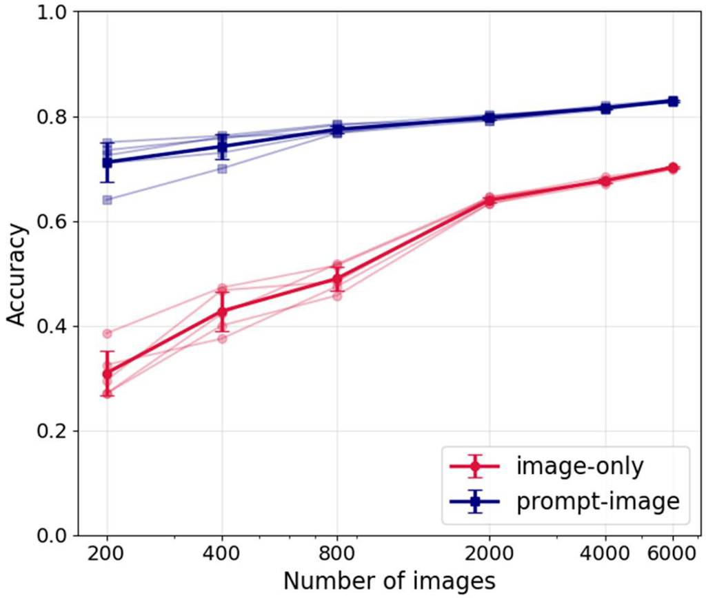
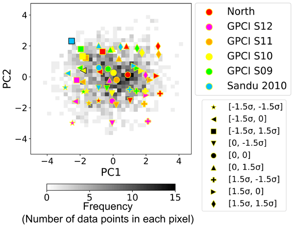
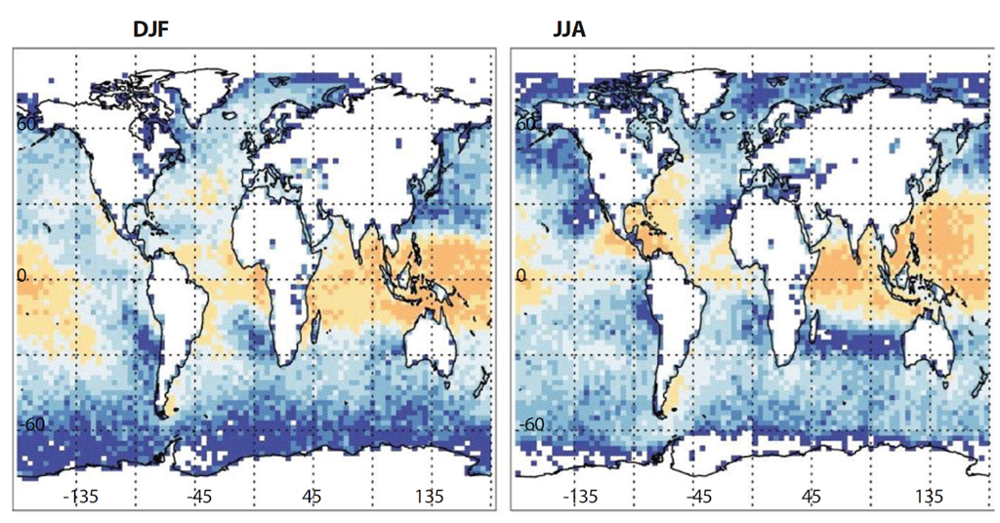
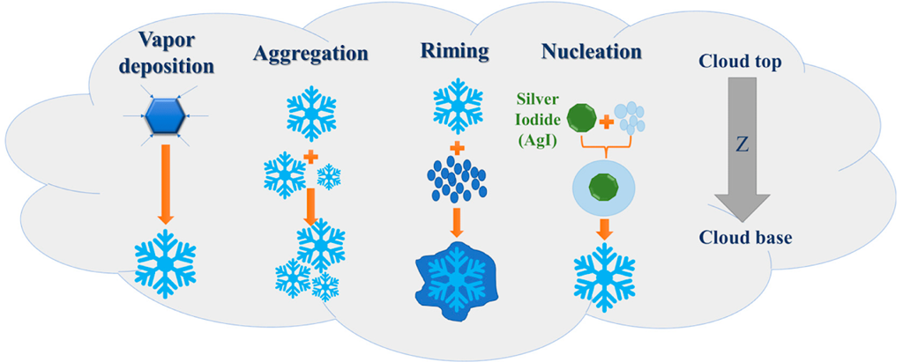
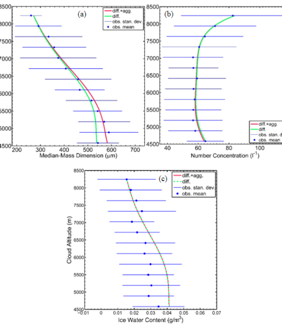
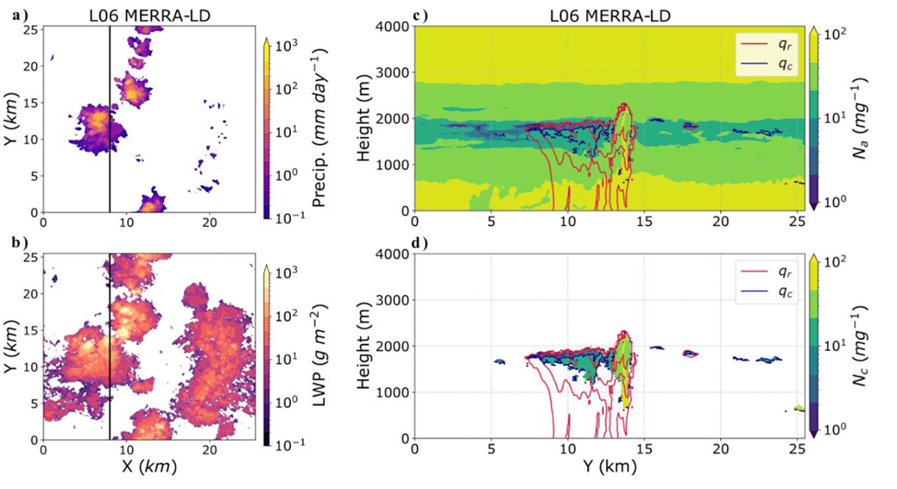

# News

---

## October 31st, 2025

**Paper published in *Atmosphere***  
**"A Novel Approach for Reliable Classification of Marine Low Cloud Morphologies with Vision–Language Models"**  
[https://doi.org/10.3390/atmos16111252](https://doi.org/10.3390/atmos16111252)

**Key points:**
- Uses a vision–language model (VLM) to classify marine low cloud morphologies from satellite imagery.
- Efficient integration of descriptive prompts with image features.
- Achieves high accuracy even with small datasets.

**Keywords:** low clouds; mesoscale cellular convection; satellite; machine learning; pattern recognition; vision-language models

  

---

## August 12th, 2025

**Paper published in *Atmospheric Chemistry and Physics***  
**"Building a comprehensive library of observed Lagrangian trajectories for testing modeled cloud evolution, aerosol–cloud interactions, and marine cloud brightening"**  
[https://doi.org/10.5194/acp-25-8743-2025](https://doi.org/10.5194/acp-25-8743-2025)

**Key points:**
- We introduce a novel approach to identify a reduced number of representative cases from a wide array of observed environmental conditions prevalent in the Northeast Pacific.
- Over 2200 trajectories are created from observations, and cloud-resolving simulations are used to investigate how marine low clouds evolve in two different cases.
- It is shown that aerosols can delay cloud breakup, but their impact depends on precipitation.

**Keywords:** aerosol-cloud interaction; low clouds; large-eddy simulation; satellite; remote sensing; principal component analysis; precipitation; cloud radiative effect

  

---

## January 6th, 2025

**Book chapter published in the [Geoengineering book](https://onlinelibrary.wiley.com/doi/book/10.1002/9781394204847) (Wiley)**  
**"Cirrus Cloud Thinning"**  
[https://doi.org/10.1002/9781394204847.ch18](https://doi.org/10.1002/9781394204847.ch18)

**Key points:**
- Cirrus Cloud Thinning (CCT) aims to cool the planet by converting cirrus clouds from homogeneous to heterogeneous, allowing more outgoing longwave radiation to escape to space, especially in winter polar regions.
- Uncertainties in cirrus-cloud microphysics are a barrier for validating the feasibility of CCT, but satellite data (e.g., CALIPSO) can improve model representation.

**Keywords:** cirrus cloud thinning (CCT); geoengineering; ice nucleation; homogeneous; heterogeneous; outgoing longwave radiation (OLR); cloud optical thickness; polar regions; CALIPSO; ice-nucleating particles (INPs); cloud radiative effect (CRE)

  

---

## October 25th, 2024

**Paper published in *Atmosphere***  
**"Quantifying the Influence of Cloud Seeding on Ice Particle Growth and Snowfall Through Idealized Microphysical Modeling"**  
[https://doi.org/10.3390/atmos15121460](https://doi.org/10.3390/atmos15121460)

**Key points:**
- Cloud seeding increases ice particle concentration, ice water content, and snowfall rates.
- The magnitude of impact depends on atmospheric and environmental conditions.

**Keywords:** weather modification; snow growth model; aerosol–cloud interactions; cloud seeding; microphysics; ice particle growth

  

---

## April 30th, 2024

**Preprint posted on EarthArXiv**  
**"Development of a Snow Growth Model for Rimed Snowfall"**  
[https://doi.org/10.31223/X5QM51](https://doi.org/10.31223/X5QM51)

**Key points:**
- Developed a snow growth model simulating vapor deposition, aggregation, and riming.
- Model is validated using in-flight observations during a Lagrangian spiral descent.

**Keywords:** ice cloud microphysics; cloud modeling; snow growth model; frontal clouds; cirrus; mixed-phase clouds; aggregation; vapor deposition; particle size distribution

  

---

## October 20th, 2022

**Paper published in *Journal of Geophysical Research – Atmospheres***  
**"Simulating aerosol lifecycle impacts on the subtropical stratocumulus-to-cumulus transition using large-eddy simulations"**  
[https://doi.org/10.1029/2022JD037258](https://doi.org/10.1029/2022JD037258)

**Brief summary:**
- LES + interactive aerosol model used to study aerosol impacts during stratocumulus-to-cumulus transition.
- Model results agree with observations.
- Shows precipitation–aerosol scavenging feedback → formation of ultra-clean layers near inversion.
- Precipitation regulates cloud-radiative adjustments.

[*I also wrote a lay summary article on Medium.*](https://medium.com/@Ehsan_Sci/simulating-aerosol-impacts-on-warm-low-clouds-52c663a512f6)

  

---

